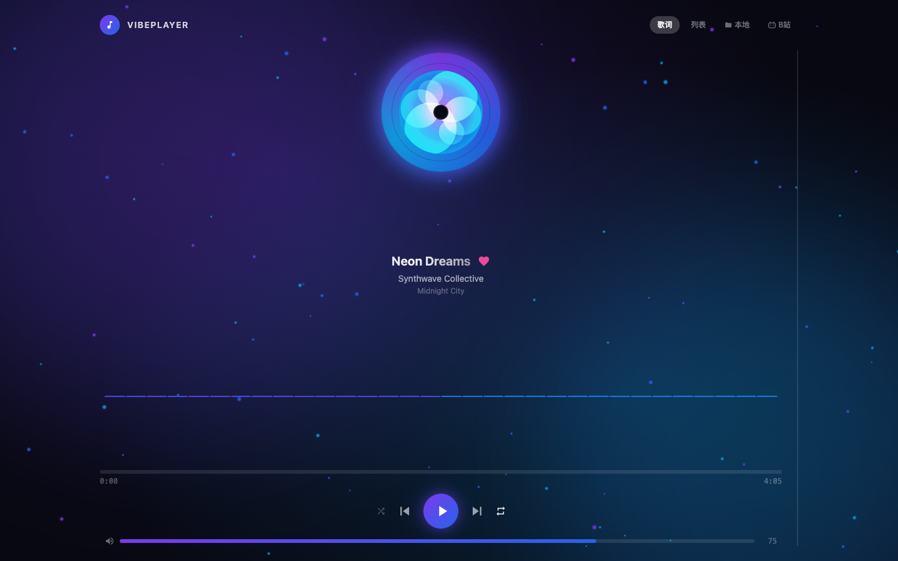
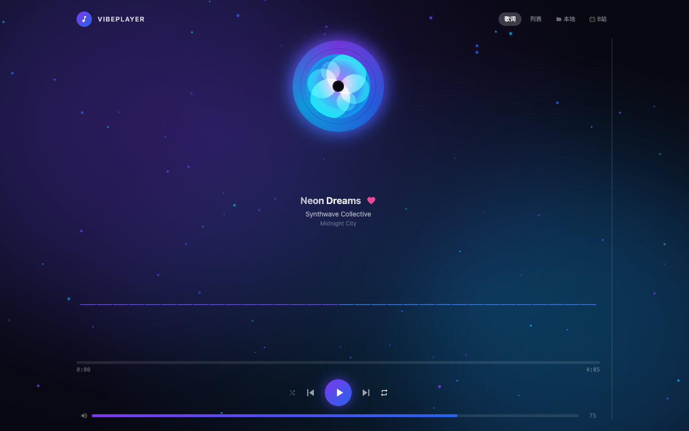
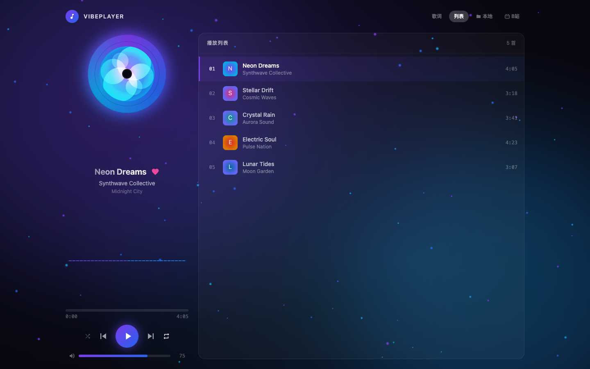
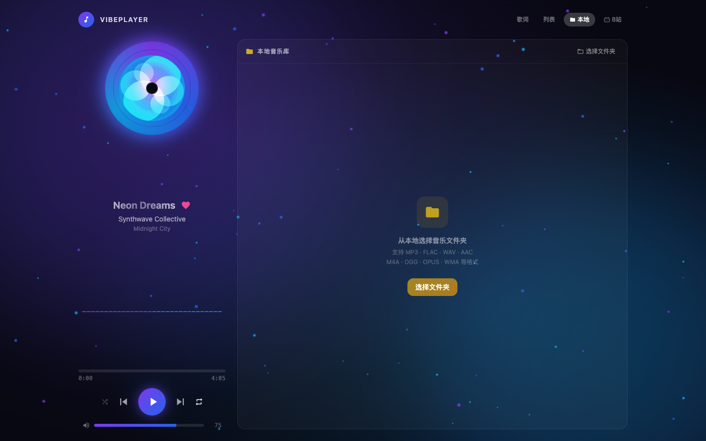
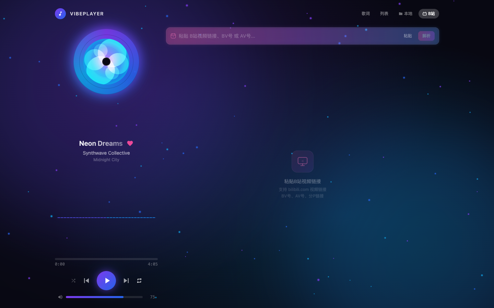

# 🎵 VibePlayer — A Stunning Web Music Player

<p align="center">
  <strong>A visually stunning web music player with particle effects, spectrum visualization, and multi-source playback</strong>
</p>

---

## ✨ Features

| Feature | Description |
|---------|-------------|
| 🌌 Particle Background | Real-time floating particles rendered on Canvas with glowing trails |
| 💿 Vinyl Record Animation | Auto-rotating disc with conic gradient textures and dynamic glow |
| 📊 Spectrum Visualizer | 32 color spectrum bars that pulse to the music |
| 🎤 Lyrics Sync | Current line highlighted with gradient glow, auto-scrolling |
| 📋 Playlist Management | Favorite songs, switch play modes (sequential / shuffle / repeat one) |
| 📁 Local Music Library | Select local folders, recursive scan, directory tree display, click to play |
| 🎬 Bilibili Integration | Paste Bilibili URLs, resolve video info, embedded player |
| 🎚️ Full Player Controls | Progress bar seek, volume slider, prev/next, play/pause |

---

## 🖼️ Screenshots

### 🎵 Main Player View



The main view features a spinning vinyl record, song info, spectrum visualizer, progress bar, and playback controls. The background uses dynamic gradients + floating particles that change color based on the current song's theme.

### 📜 Lyrics Panel



The lyrics panel is displayed by default. The currently playing line is highlighted with a gradient glow effect, and lyrics auto-scroll to follow the playback progress.

### 📋 Playlist



View the complete playlist with favorite markers and one-click song switching. The currently playing track shows a mini spectrum indicator.

### 📁 Local Music Library



Click the "Local" button in the top navigation to open the local music library panel. After selecting a folder, all supported audio files are scanned recursively and displayed in a directory tree structure. Expand/collapse folders and click any song to play.

### 🎬 Bilibili Panel



Click the "B站" button in the top navigation to open the Bilibili panel. Paste a Bilibili video URL to auto-resolve, displaying video info with an embedded player. Supports playback history.

---

## 🎮 User Guide

### Basic Playback
- **Play/Pause**: Click the play button at the bottom
- **Prev/Next**: Click the forward/backward buttons
- **Seek**: Click anywhere on the progress bar
- **Volume**: Drag the volume slider or click the speaker icon to mute

### Play Modes
- **Sequential**: Loop through all songs in order
- **Repeat One**: Repeat the current song
- **Shuffle**: Randomly select the next song

### Panel Switching
Four panels are available in the top navigation bar:

| Button | Panel | Description |
|--------|-------|-------------|
| 歌词 | Lyrics | Lyrics sync display |
| 列表 | Playlist | Song playlist |
| 本地 | Library | Local music library |
| B站 | Bilibili | Bilibili player |

### Local Music Library
1. Click the "**Local**" button at the top
2. Click the "**Select Folder**" button
3. Choose a music folder in the system dialog
4. Wait for scanning to complete — the directory tree appears automatically
5. Click the arrow to expand/collapse folders
6. Click any song name to start playing

**Supported Formats**: MP3, FLAC, WAV, AAC, M4A, OGG, OPUS, WMA, AIFF, APE

### Bilibili Playback
1. Click the "**B站**" button at the top
2. Paste a Bilibili video URL in the input field
3. Click the "**Resolve**" button or press Enter
4. Upon success, video info and an embedded player are displayed

**Supported URL Formats**:
- Full URL: `https://www.bilibili.com/video/BV1B7411m7LV`
- BV ID: `BV1B7411m7LV`
- AV ID: `av12345`
- Multi-part: `...?p=2`

---

## 🛠️ Tech Stack

### Core Framework
| Technology | Version | Description |
|------------|---------|-------------|
| React | 19.2 | UI framework |
| TypeScript | 5.9 | Type safety |
| Vite | 7.2 | Build tool & dev server |

### UI & Styling
| Technology | Version | Description |
|------------|---------|-------------|
| Tailwind CSS | 3.4 | Utility-first CSS framework |
| shadcn/ui | — | High-quality component library (based on Radix UI) |
| Radix UI | — | Accessible primitive components |
| lucide-react | 0.562 | Icon library |
| class-variance-authority | 0.7 | Component variant management |
| tailwindcss-animate | 1.0 | Animation extension |

### Effects & Visualization (Custom)
| Module | Technology |
|--------|------------|
| Particle Background | HTML5 Canvas + requestAnimationFrame |
| Spectrum Visualizer | Canvas 2D |
| Vinyl Record Rotation | CSS Keyframes |
| Lyrics Highlighting | React state-driven + CSS gradients |

### Data & Utilities
| Technology | Version | Description |
|------------|---------|-------------|
| react-hook-form | 7.70 | Form management |
| zod | 4.3 | Data validation |
| date-fns | 4.1 | Date utilities |
| recharts | 2.15 | Chart components |

---

## 📁 Project Structure

```
app/
├── docs/
│   └── screenshots/          # UI screenshots
├── src/
│   ├── sections/             # Core business modules
│   │   ├── MusicPlayer.tsx        # Main player container
│   │   ├── PlayerControls.tsx     # Playback controls (progress, volume, modes)
│   │   ├── LyricsPanel.tsx        # Lyrics sync panel
│   │   ├── PlaylistPanel.tsx      # Playlist panel
│   │   ├── SpectrumVisualizer.tsx # Audio spectrum visualizer
│   │   ├── ParticleBackground.tsx # Particle background effects
│   │   ├── LocalFileTree.tsx      # Local music directory tree
│   │   └── BilibiliPanel.tsx      # Bilibili panel
│   ├── components/
│   │   └── ui/              # shadcn/ui shared components (53)
│   ├── hooks/               # Custom React Hooks
│   │   ├── useLocalLibrary.ts     # Local file management
│   │   └── useBilibili.ts         # Bilibili URL resolution
│   ├── lib/                 # Utility functions
│   ├── App.tsx              # App entry point
│   └── main.tsx             # Render entry point
├── index.html
├── package.json
├── tailwind.config.js
├── vite.config.ts
└── tsconfig.json
```

---

## 🚀 Quick Start

### Prerequisites
- Node.js >= 20.19
- npm >= 10

### Install & Run

```bash
# Clone the repository
git clone <repo-url>
cd app

# Install dependencies
npm install

# Start dev server
npm run dev

# Build for production
npm run build
```

Visit `http://localhost:5173/` after starting the dev server.

---

## 📝 License

MIT License

---

<p align="center">
  Built with ❤️ using React + TypeScript + Tailwind CSS
</p>
